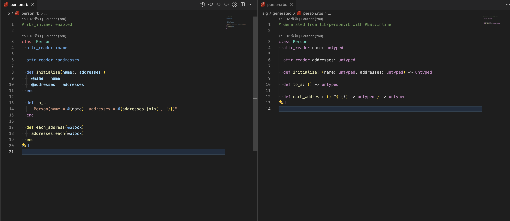
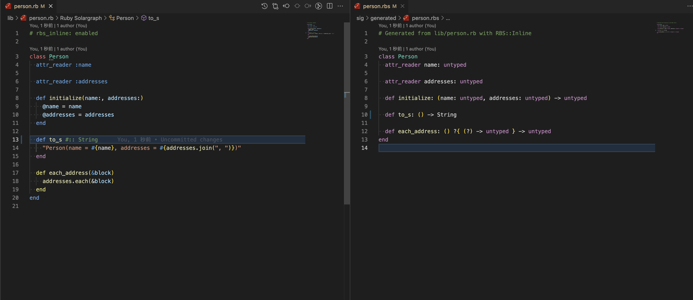
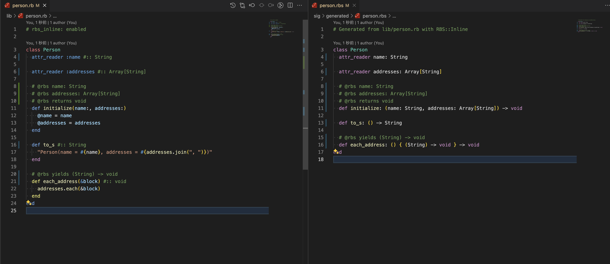

# RBS::Inline test

## libs

- rbs-inline
- steep

```console
bundle install
```

```console
fswatch -0 lib | xargs -0 -n1 bundle exec rbs-inline --output
```

edit .rb and generate .rbs files

```
lib/*.rb -> sig/generated/*.rbs
```

VS Code Steep extension will show the type information and show the error message.

```console
bundle exec steep check
```

## Images

- 
- 
- 
